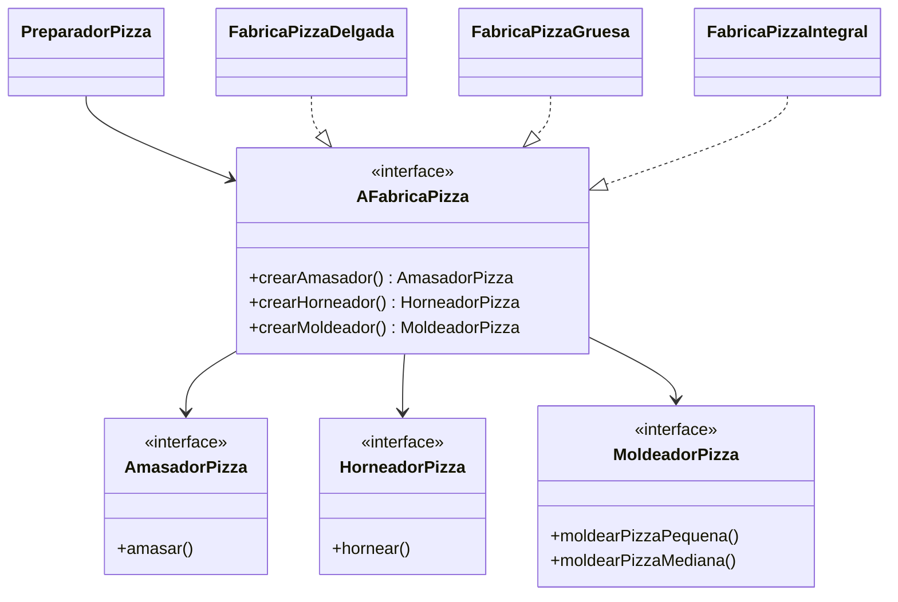

# Diagrama de clases — Fábrica Abstracta

Cada fábrica concreta produce una familia compatible de amasador, moldeador y
horneador. `FabricaPizzaProvider` selecciona la fábrica configurada sin que el
cliente dependa de una implementación concreta.
